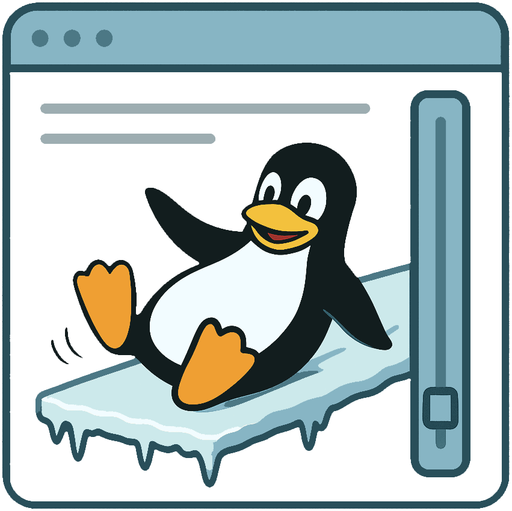

# Linux Scroll Fix

**Inspired by [Mac Mouse Fix](https://github.com/noah-nuebling/mac-mouse-fix), but for Linux!**



## Overview

**LinuxScrollFix** is a simple script that enables toggling your trackball mouse movements into 2D scrolling on Linux. It supports two convenient activation methods:
- **Hold a button on your trackball (e.g., BTN4)**
- **Press a key on your keyboard (mapped to BTN4 via QMK mouse emulation)**

This is perfect for users who want Mac-style smooth scrolling with their trackball on Linux, especially if you use QMK-powered devices.

---

## Why?

After switching from macOS to Linux, I missed the seamless 2D scrolling experience provided by Mac Mouse Fix. No out-of-the-box solution existed for my setup, so I built this script to fill the gap.

---

## Features

- **Toggle 2D scrolling** with a mouse button or keyboard key
- **Works with QMK-powered devices** (tested with Cantor Remix and Ploopy Adept trackball)
- **Lightweight and easy to use**
- **Customizable for your hardware**

---

## Supported Hardware

- **Trackballs:** Ploopy Adept (should work with others)
- **Keyboards:** Any QMK-powered device (e.g., Cantor Remix)
- **Any device that can send BTN4 events should work but was not tested**

---

## Getting Started

### 1. Clone the Repository

```bash
git clone https://github.com/yourusername/LinuxScrollFix.git
cd LinuxScrollFix
```

### 2. Requirements

- Python 3.x
- `evdev` & `uinput` Python libraries
  Install with:
  ```bash
  sudo apt install python3-evdev python3-uinput
  ```

### 3. Usage

1. **Identify your input devices** (trackball and/or keyboard) using `lsinput` or `evtest`. The name probably ends with ` Mouse`.
  _Alternatively, you can run the script unchanged, it will list all your devices._
2. **Edit `scrollBtn4.py`** to set the correct device paths if needed.
3. **Run the script:**
   ```bash
   sudo python3 scrollBtn4.py
   ```
   (Root privileges are required to read input events.)

4. **Scroll!**  
   - Hold BTN4 on your trackball, or  
   - Press the mapped key on your QMK keyboard  
   and move your trackball to scroll horizontally and vertically.

---

## Customization

- **Change the activation button:**  
  Edit the script to use a different button or key if desired.
- **Adjust scroll speed or behavior:**  
  Tweak the script’s parameters to fit your preferences.

---

## Troubleshooting

- **No scrolling?**  
  - Make sure you’re running the script as root.
  - Double-check your device paths, if multiple options, choose the one that ends with "Mouse".
  - Ensure your QMK device is sending the correct mouse button event.

- **Need help?**  
  Open an issue or start a discussion!

---

## Contributing

Contributions, suggestions, and bug reports are welcome!  
Feel free to fork, submit pull requests, or open issues.

---

## Credits

- Inspired by [Mac Mouse Fix](https://github.com/noah-nuebling/mac-mouse-fix)
- Thanks to the [QMK](https://qmk.fm) and [Ploopy](https://ploopy.co) communities!

---

## License

[MIT License](LICENSE)
